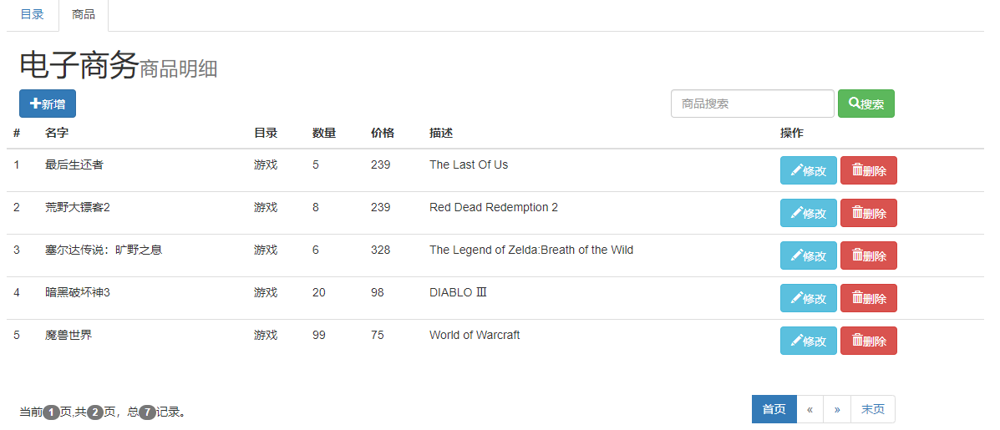
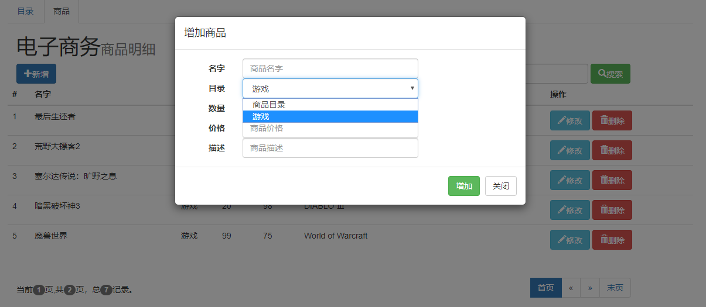
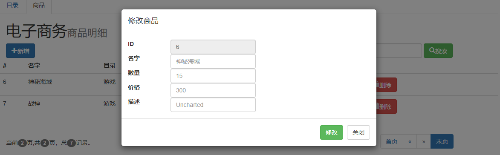

# myBusiness

A simple SSM-CRUD project

## 概述

一个简单的基于SSM的增删改查项目。

## 开发环境

- 操作系统：Windows 10 2019 LTSC
- 开发工具：Intellij IDEA, DataGrip
- 数据库：MySQL 8.0.13
- Java SDK：Oracle JDK 1.8.152

## 项目管理

- 项目构建：Maven
- 代码管理：Git

## 技术栈

- 核心框架：Spring MVC
- ORM 框架：MyBatis（使用PageHelper进行分页）
- 数据库连接池：c3p0
- 前端页面：JSP
- 前端框架：Bootstrap

## 预览

